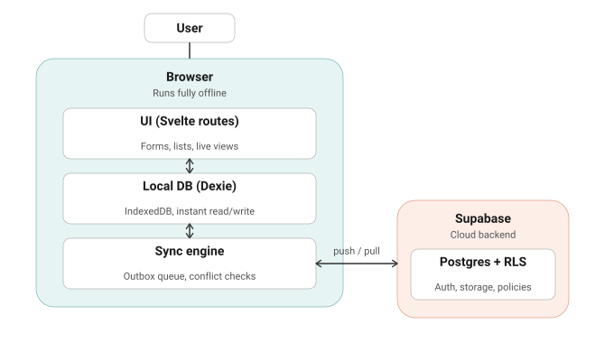
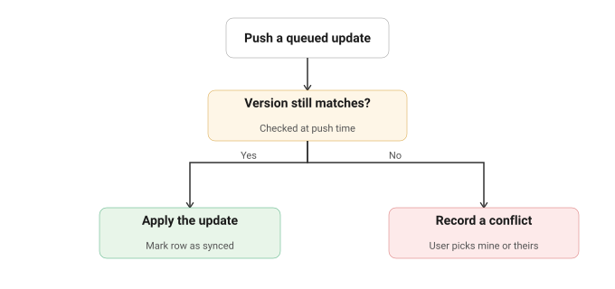
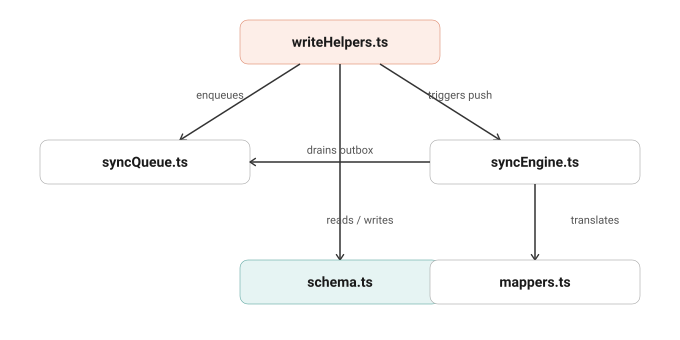
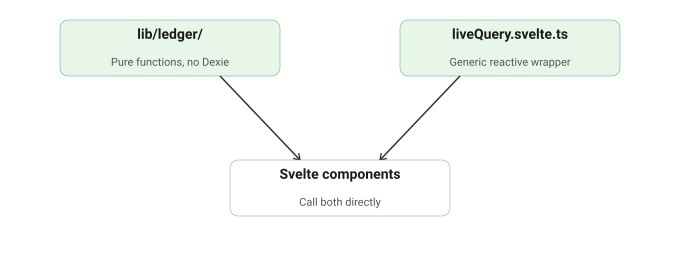
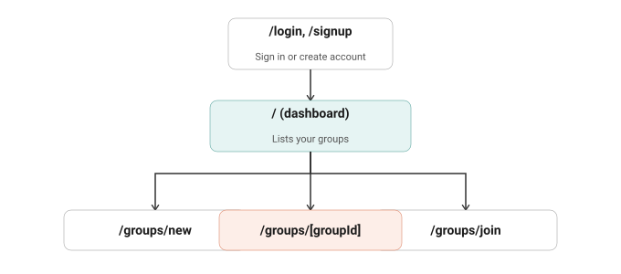
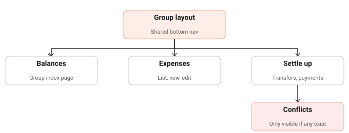

# Tally — Offline-First Expense Splitter

A group expense-splitting PWA, built local-first: every read and write hits IndexedDB (via Dexie.js) first, then syncs to Supabase in the background. Inspired by Splitwise/Splid.

## Tech Stack

| Layer | Choice |
|---|---|
| Framework | SvelteKit (TypeScript, Svelte 5 runes) |
| Styling | Tailwind CSS v4 |
| Local storage | Dexie.js (IndexedDB wrapper) |
| Backend | Supabase (Postgres + Auth + Row Level Security) |
| PWA / offline | `@vite-pwa/sveltekit` (`injectManifest`) + hand-written service worker |
| Testing | Vitest |
| Fonts | Fraunces (money/headlines), Instrument Sans (UI), IBM Plex Mono (data) |
| Deployment | Netlify (see Deployment section — not Vercel, for a documented reason) |

## Architecture Overview



Everything runs in the browser first. A write lands in Dexie instantly, online or not. The sync engine talks to Supabase only in the background — the network is never on the critical path for the UI feeling responsive.

## Core Architecture Concepts

1. **Integer cents, always.** No floats, anywhere — `amountCents`/`shareCents` only.
2. **Zero-sum ledger**, enforced three times: the split engine (shares must sum to the total), the balance calculator (net balances must sum to zero), and a Postgres deferred trigger as a DB-level backstop.
3. **Local-first read/write.** Components never call Supabase directly. Reads go through `useLiveQuery()` (Dexie's reactive query, bridged into a Svelte rune); writes go through one function per operation in `writeHelpers.ts`, which writes to Dexie *and* enqueues the sync entry atomically.
4. **Outbox pattern.** Every local write enqueues a `SyncQueueEntry`. `pushPendingChanges()` drains it on reconnect with retry/backoff; `pullRemoteChanges()` fetches everything RLS allows and `bulkPut`s it into Dexie. Splits are pushed as one batched `upsert()`, not row-by-row (gotcha #1).
5. **Immutability.** Expenses/settlements soft-delete via `deletedAt`; every expense change writes an append-only `AuditLogEntry`. Splits have no soft-delete at all — a removed member's share gets zeroed instead.
6. **Approval-gated membership.** Joining by code creates a `pending` row; the creator must approve it. Join-code lookups are proxied through a `SECURITY DEFINER` RPC, never a direct `SELECT`.
7. **Optimistic-concurrency conflict detection.** Every syncable table carries a server-bumped `version`. Pushing an update is conditional (`WHERE version = <base>`), not a blind upsert — a mismatch means someone else edited it first, and it's recorded as a `Conflict` instead of silently overwritten.

   

8. **Settlements** are real payments, separate from expenses. New settlement inserts route through a dedup RPC (`record_settlement_dedup`, migration 0006) that uses an advisory lock to catch two devices recording the same payment while both offline — closing the race a client-side check alone can't.
9. **Cross-device notifications.** A "keep mine" conflict resolution writes a `sync_overrides` row; every other device's next pull checks "was this my own resolution?" and shows a dismissible banner if not.

## Code Organization



`writeHelpers.ts` is the only entry point — it enqueues into `syncQueue.ts`, triggers `syncEngine.ts` to push, and reads/writes `schema.ts`'s single Dexie instance directly. `mappers.ts` is a pure leaf, only translating field names.



`lib/ledger/` and `liveQuery.svelte.ts` are deliberately decoupled from all of the above — pure functions with no knowledge of Dexie or Supabase, which is exactly what makes the split/balance math independently unit-testable.

## ⚠️ Gotchas hit building this

1. **RLS + `upsert()`**: Postgres evaluates INSERT, UPDATE, and SELECT policies on any `ON CONFLICT DO UPDATE`, even for genuine first-time inserts. Any table pushed via `upsert()` needs all three policies to independently allow "I own this row," without depending on a not-yet-synced lookup.
2. **`splits` needs an UPDATE policy too** — the original migration only had INSERT/SELECT, silently blocking every expense edit (fixed in `0002`).
3. **`adapter-static`'s SPA fallback defaults to relative asset paths**, breaking every nested route. Fix: `paths: { relative: false }`. Separately, `vite preview` doesn't reliably honor this either — use a real static server (`npx serve build -s`) for offline testing.
4. **Sync doesn't restart after login** by default, since `hooks.client.ts` only runs once at boot and login navigates client-side. Fixed with a `supabase.auth.onAuthStateChange` listener re-running `runFullSync()`.
5. **Splits don't get their own per-row conflict detection** — gated at the parent expense's level instead, since per-row optimistic locking would need a custom Postgres RPC to stay compatible with the batched-upsert requirement (gotcha #1's cousin). A `keep mine` resolution can, rarely, still overwrite a concurrent split-only edit. Accepted scope limit, not a bug.
6. **`generateSW` can't work for a pure SPA** — it validates against a precache manifest before `adapter-static` ever writes the fallback HTML. Fixed by switching to `injectManifest` with a hand-written `service-worker.ts`.
7. **A service worker can't intercept the navigation that installs it** — the shell must be cached proactively in the `install` handler, not lazily on first navigation.
8. **`injectManifest` needs `self.__WB_MANIFEST` to appear exactly once** — it's a literal find-and-replace, not AST-aware. Assign it to a variable first if referencing it more than once.
9. **`self.__WB_MANIFEST` is a real array only in a production build** — guard it in dev mode (`Array.isArray(...) ? ... : []`).
10. **TypeScript's Supabase client needs literal table names**, not a `string`-typed return — a runtime-picked table name breaks every `.from()` overload unless cast at one narrow, documented boundary.
11. **`injectManifest` fails on remote Linux CI specifically** — confirmed identical on two independent platforms (Vercel, Netlify), confirmed *not* a race (two consecutive attempts fail the same way). Likely an upstream hook-scoping bug under Vite 8's environments API. See Deployment.

## Project Setup

```bash
npx sv create expense-splitter-pwa
cd expense-splitter-pwa
npm install tailwindcss @tailwindcss/vite dexie @supabase/supabase-js
npm install -D @vite-pwa/sveltekit vite-plugin-pwa workbox-core workbox-precaching workbox-routing workbox-strategies workbox-window @sveltejs/adapter-static
npm install -D vitest prettier eslint supabase

npx supabase login
npx supabase link --project-ref <your-project-ref>
npx supabase db push
npx supabase gen types typescript --project-id <your-project-ref> > src/lib/supabase/types.ts
```

Create `.env`: `PUBLIC_SUPABASE_URL`, `PUBLIC_SUPABASE_ANON_KEY`.

**Critical**: `vite.config.ts` must register `tailwindcss()`, `SvelteKitPWA(...)`, and `paths: { relative: false }` — installing packages alone doesn't wire them in.

### Testing offline locally
`npm run dev` can't validate offline behavior — no valid service-worker manifest exists until a production build, and dev mode needs a live HMR connection anyway. Use:
```bash
npm run build
npx serve build -s -p 4173
```

## Data Model

**Dexie (local)** — schema v5, 9 tables: `groups`, `members`, `expenses`, `splits`, `auditLog`, `syncQueue`, `settlements`, `conflicts`, `syncNotifications`. Every syncable record has `syncStatus` and (except splits/auditLog/conflicts/notifications) a server-managed `version`.

**Supabase (remote)** — 6 migrations, applied in order:

| File | Adds |
|---|---|
| `0001_init.sql` | Core schema, RLS, `is_approved_member()`/`is_group_creator()`/`join_group_by_code()` |
| `0002_splits_update_policy.sql` | Missing UPDATE policy on `splits` |
| `0003_settlements.sql` | `settlements` table |
| `0004_optimistic_concurrency.sql` | `version` column + trigger on every syncable table |
| `0005_sync_overrides.sql` | Cross-device conflict-resolution notifications |
| `0006_settlement_dedup.sql` | `record_settlement_dedup()` RPC, advisory-lock-serialized |

`mappers.ts` is the single source of truth translating `camelCase` ↔ `snake_case`. Client-generated UUIDs mean the same ID exists in Dexie and Postgres from creation — no reconciliation step.

## Feature Status

| Feature | Status |
|---|---|
| Groups, join-by-code, approval flow | ✅ |
| Sign-up / sign-in | ✅ |
| Equal / percentage / custom splits | ✅ |
| Edit / delete expense | ✅ |
| Debt simplification | ✅ |
| Record a settlement + undo | ✅ |
| Server-side settlement duplicate prevention | ✅ |
| Offline sync (push + pull, retry/backoff) | ✅ |
| PWA install + offline fallback | ✅ |
| Conflict detection + resolution UI | ✅ |
| Cross-device override notifications | ✅ |
| Per-row conflict detection for splits | ⏳ accepted scope limit — gotcha #5 |
| Multi-currency | ⏳ stored, not validated/converted |

## Project Structure




```
src/
├── lib/
│   ├── db/          # schema.ts, types.ts, writeHelpers.ts
│   ├── sync/        # syncQueue, syncEngine, mappers, conflictSummary
│   ├── ledger/      # splitEngine, balances, debtSimplifier
│   ├── supabase/    # client + generated types
│   ├── components/  # TopBar, GroupBottomNav
│   └── utils/       # liveQuery.svelte.ts
├── routes/          # see diagrams above
├── service-worker.ts
└── app.html
supabase/migrations/
tests/
```

## Design System

Ledger-green paper (`#ECF0E6`), forest-green credit, brick-red debit, brass accent — an old-accounting-book look, not generic fintech. Fraunces for money/headlines only; Instrument Sans for UI; IBM Plex Mono for system data. Signature "stub tear" dashed divider (`.stub-tear`).

## Testing

```bash
npm run test    # split engine, balances, debt simplifier
npm run check   # TypeScript + Svelte diagnostics
```

## Deployment

**Netlify, not Vercel — for a confirmed, specific reason.** `@vite-pwa/sveltekit`'s `injectManifest` fails deterministically on cold Linux CI builds (`ENOENT: service-worker.js`) — reproduced identically on both Vercel's and Netlify's build infrastructure, and confirmed not to be a timing race. It succeeds 100% of the time locally. Root cause looks like a `closeBundle` hook-scoping bug under Vite 8's environments API, upstream and not fixable from this project.

**The fix**: never let CI build this project. Build locally, deploy only the static output.

```bash
npm install -g netlify-cli
netlify login
netlify link            # link the existing site, don't create a new one

# every deploy after that:
netlify deploy --prod --dir=build
```

`postbuild` (in `package.json`) writes `build/vercel.json` and `build/_redirects` automatically after every build, so the output is SPA-fallback-ready for either platform regardless of which one hosts it. Do not connect this repo to Netlify/Vercel's GitHub auto-deploy — that triggers the exact remote build that fails.

## Known Gaps

1. **Per-row split conflict detection** — see gotcha #5.
2. **Multi-currency** — not actively validated or converted.
3. **`@vite-pwa/sveltekit` + Vite 8 remote-build incompatibility** — see Deployment. Worth revisiting if upstream fixes it.
